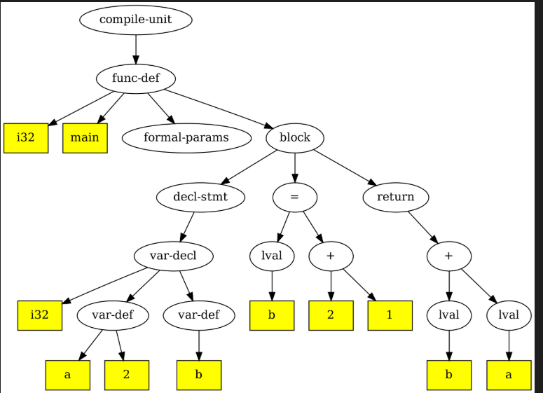
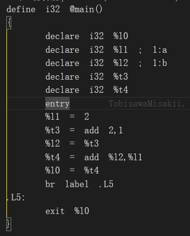
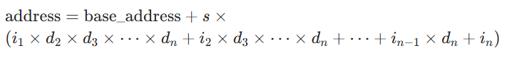
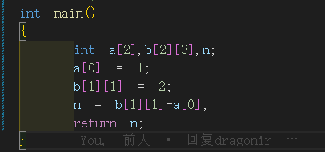
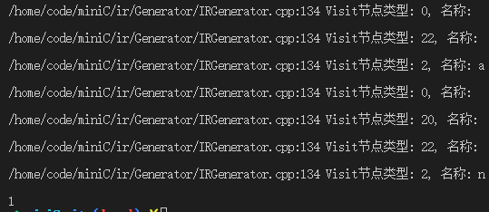

# 一、理解整个ir流程

## 目前完成了ir的乘法，已通过IRCompiler完成了验证，如下图：


## 以下讲解ir的主要内容以及修改的主要部分

### ir的主要内容：
**主体部分在/home/code/exp04-minic/ir/Generator/IRGenerator.cpp，IRGenerator是将抽象语法树(AST)转换为中间表示(IR)的核心组件，IRGenerator类负责遍历 AST节点，根据节点类型调用相应的翻译函数，生成IR指令，并将这些指令添加到InterCode对象中。具体的IR指令类用于表示不同类型的操作，在生成IR代码时，根据语义创建相应的指令对象并添加到指令列表中。以下是其运行流程的详细说明：**

**1. 关键数据结构**

- **ast_node**：AST节点，包含子节点列表、节点类型、值信息等
- **InterCode**：存储线性IR指令序列
- **Module**：管理全局信息(函数、变量、作用域等)
- **Function**：表示函数实体，包含IR指令列表和函数信息
- **各种Instruction**：表示具体的IR指令(如BinaryInstruction、MoveInstruction等)
- **blockInsts**：ast_node 结构中的一个关键成员，用于在 AST 到 IR 的转换过程中 临时存储 当前节点及其子节点生成的所有 IR 指令。

**2. 初始化阶段**

- **构造函数**：接收AST根节点和Module对象，初始化ast2ir_handlers映射表，建立AST节点类型到处理函数的对应关系
- **处理器映射**：为每种AST节点类型(如AST_OP_ADD、AST_OP_FUNC_DEF等)注册对应的处理函数(如ir_add、ir_function_define等)

**3. 主运行流程**

1. **启动入口**：通过run()方法开始IR生成过程
2. **根节点处理**：从AST根节点(通常是编译单元AST_OP_COMPILE_UNIT)开始遍历
3. **节点分发**：通过ir_visit_ast_node方法根据节点类型调用对应的处理函数

**主要修改在（可能不全）：**
管理指令：
/home/code/exp04-minic/bash.sh

/home/code/exp04-minic/ir/Instruction.h：

```
 /// @brief 整数的乘法指令，二元运算
    IRINST_OP_MUL_I,
```
/home/code/exp04-minic/ir/Instructions/BinaryInstruction.cpp:

```
// 在指令执行逻辑中添加（例如在某个执行循环中）
        case IRInstOperator::IRINST_OP_MUL_I: {
            // 乘法指令，二元运算
            str = getIRName() + " = mul " + src1->getIRName() + "," + src2->getIRName();
            break;
        }
```
/home/code/exp04-minic/ir/Generator/IRGenerator.cpp

# 二、完善ir功能

## 调试
1. 使用调试工具定位问题
使用 gdb 调试
运行以下命令启动调试器：
``` 
gdb ./build/minic
```
在 gdb 中运行程序：
```
run -S -A -I -o tests/test1-1.ir tests/test1-1.c
```
当程序崩溃时，gdb 会显示段错误发生的位置。使用以下命令查看调用栈：
```
bt
```

```
gdb --args tools/IRCompiler/Linux-x86_64/Ubuntu-22.04/IRCompiler -R tests/test1-1.ir
run
bt  # 崩溃时查看调用栈
```
2.bash.sh文件
文件中每条指令有注释，且包含minic编译器的命令讲解和git指令便于查阅
## declare statement
**文法表示参考：**


**完善变量定义时初始化以及连续定义：**
流程：
·block节点visit所有子节点，子节点处理完后都node->blockInsts.addInst(temp->blockInsts);对于decl-stmt节点，将var-decl节点传入visit，var-decl再将子节点i32传入visit，var-def将叶子节点并不传入visit，而是直接调用ir_variable_define,因为要传入变量类型i32，所以不能复用visit。暂时不知道怎么复用。叶子节点处理完后都将ir表示放入node->blockInsts，父节点存入自己的，node->blockInsts.addInst(node->sons->blockInsts)。

**.c文件：**

**生成的ir：**


## 增加数组类型 
对于数组类型，主要操作在ir_lval函数。当传入为数组时，对于ir_assign的左值不做处理(将node->store置为true)，留在ir_assign单独处理store指令生成，而对于其他情况，全都在ir_lval处理load指令生成(类似%l5=*%t17)，返回的是普通变量%15，而不是数组地址。这样方便增加功能时不必额外考略数组处理，按一般情况处理就行。注意，不支持数组定义时初始化，也不支持a[5]={1,2,3,4,5}这样的连续赋值（因为zlj的也不行）
我们采用行优先存储，地址计算参考：




## 增加带参函数

**函数调用：**

ArgInstruction这个没用，生成arg指令，但我们不用生成这个指令，dragonir也不推荐使用这个来生成函数调用的参数。

realArgCount是所有函数公用的，FuncCallInstruction里使用这个最为函数参数数量不合理，直接删去相关使用

OperandsNum是每条指令自己的参数列表，使用这个每次调用才正确。注意不能遍历所有操作符，因为里面还有返回值，返回值在最后一个，所以生成ir时略过最后一个就行。

**函数定义的形参处理：**

增加addParam方法，把形参存入向量，之前是newLocalVarValue生成临时变量保存输入的值，改用newVarValue更好，作用域更准确
