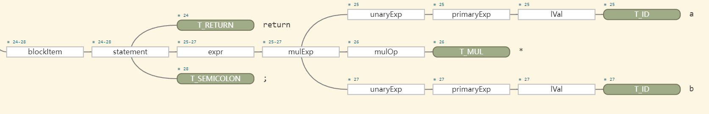
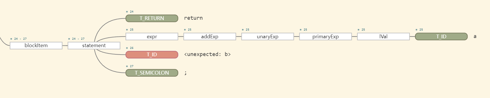
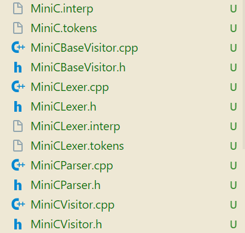
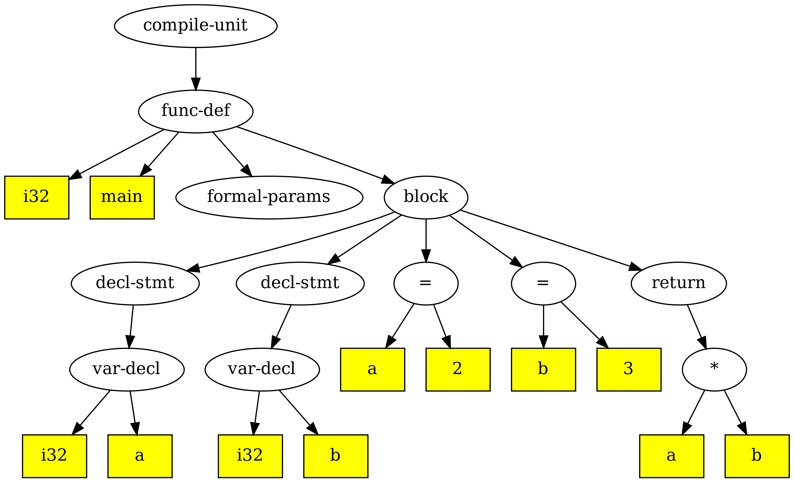

# dev_CPY开发文档

## WebSite

- [比赛官网]<https://compiler.educg.net/?token=TPOczAJinR2aJABo2cxpNeD1BnGPTmsJkWpd1yDh0A#/index?TYPE=2025COM>
- [ARM64架构文档]<https://www.kernel.org/doc/html/latest/translations/zh_CN/arch/arm64/index.html>
- [2024Compiler（包括测例）]<https://gitlab.eduxiji.net/csc1/nscscc/compiler2024/-/tree/main>
- [LLVM IR Manual]<[LLVM Language Reference Manual — LLVM 21.0.0git documentation](https://llvm.org/docs/LangRef.html)>

##  进度 & TODO

- TODO：加入ir_condition，合并条件表达式的处理，以防止多处同时修改。condition node应该出现在：if/while参数，and/or子节点，eq/ne等判断的子节点
- TODO：支持 `if (1 < 8 != 7 % 2)` ，对于condition stmt是bool类型的情况也要有所考虑
- TODO：llvm下，对整数a的操作： -!a 需要类型转换，需尽早实现不同类型间的转换，包括`bool(i1)<-->int(i32)<-->float`
- ？？syslib的静态库在本地怎么链接？？

## BUG RECORD

- (fixed)关系/加法/乘法表达式左值不识别
- (fixed)float type无法识别
- (fixed)空语句（只有一个分号）不显示在AST中
- (fixed)创建AST node的ast_node::New(ast_operator_type, ...)方法尾部添加nullptr表示全部孩子识别完成
- (fixed)var_decl 和 var_def 节点的关系错误，一个decl应该对应一个type + 多个def
- (fixed)AST节点的line_no行号属性？哪些节点有行号，哪些不需要
- (fixed)minic_log在哪？直接输出到命令行
- (fixed)unary op 测评平台未通过
- !!!全局变量赋值为-1出错

## 一、前端理解及配置

从源程序到语法树的转换过程

### 1. 环境配置
-    打开.zshrc

     ```shell
     vim ~/.zshrc
     ```

- 在文件末尾添加三行语句

  ```shell
  export CLASSPATH=".:$HOME/Compiler/exp04-minic-expr/thirdparty/antlr4/antlr-4.12.0-complete.jar:$CLASSPATH"
  alias antlr4='java -jar $HOME/Compiler/exp04-minic-expr/thirdparty/antlr4/antlr-4.12.0-complete.jar'
  alias grun='java org.antlr.v4.gui.TestRig'
  ```

-    sourse一下

     ```shell
     source ~/.zshrc
     ```

-    测试一下，输入antlr4

     ```shell
     antlr4
     ```

### 2. Grammar Debug
调整vscode/lauch.json，对tests/test1-1.c，使用Debug minic Antlr4 Grammar可以生成语法分析树


### 3.antlr4生成AST流程（以添加乘法语法为例）：
- 语法分析器的语法文件：`*.g4`，包含了词法分析器和语法分析器的规则，需要自己添加规则
- 对`.g4`文件进行编译，生成词法分析器和语法分析器的代码
- 运行词法分析器，读取输入文件，生成token流
- 运行语法分析器，读取token流，生成语法树
- 运行语法树遍历器，遍历语法树，执行相应的操作


#### 3.1 g4文件
词法和语法部分可分开放置,也可放置在一个文件中。若分开放置,一般情况下,一个文件名为 xxxLexer.g4,另一个文件名为 xxxParser.g4。若合并放置,一般情况下文件名为 `xxx.g4`。

其中，**语法是由一系列的 EBNF 范式或产生式组成,词法由一系列的正规式或正则表达式组成**

>
> EBNF特点
> 1. EBNF 范式支持的元符号比 BNF 范式多了可选运算符?、闭包运算符*、正闭包运算符+等
> 2. 对于非终结符的产生式,若只有一个,则非常简单,只要把::或者→修改为冒号（即用冒号表示“定义为”）,  非终结符用小写字母开头,终结符号用大写字母开头,最后面追加分号
>

对于**对应多个产生式的非终结符**，如

```antlr4
// 目前语句支持return和赋值语句
statement:
	T_RETURN expr T_SEMICOLON			# returnStatement
	| lVal T_ASSIGN expr T_SEMICOLON	# assignStatement
	| block								# blockStatement
	| expr? T_SEMICOLON					# expressionStatement;
```

可以针对 statement的每个产生式起一个别名,用于后续遍历时方便定位到底 stmt 用哪个产生式来推导。该别名类似一个非终结符号名,需以小写字母开头,并且不能和其它的非终结符重名

词法部分由一系列的正规式定义组成。每条正规式定义冒号前为大写字母开头的  非终结符,冒号后给出它的正规式定义,需要时还可通过符号”->”引入一些动作符号 (比如skip), 最后以分号结尾，例如

```antlr4
T_DIGIT: [0-9][0-9]*;  
LineComment: '//' ~ [\r\n]* -> skip;
```


测试修改g4文件，添加乘法文法，尝试跑通从g4文件到AST的流程：；


```antlr4
// 表达式文法 expr : AddExp 表达式目前只支持加法与减法运算 新增了乘法运算测试 mulExp
expr: addExp | mulExp;

// 乘法表达式定义
mulExp: unaryExp (mulOp unaryExp)*;

// 乘法运算符
mulOp: T_MUL;

T_MUL: '*';
```

g4修改后可以支持乘法文法，写一个测例tests/test-mul.c

```cpp
int main()
{
    int a;
    int b;
    int c,d;
    a = 2;
    b = 3;

    return a * b;
}
```

使用debug的Debug minic Antlr4 Grammar模式测试（需要在编辑器中打开g4文件），如果文法正确可以生成一颗AST



其中包含mulExp。如果将`tests/test-mul.c`中的return语句改为

```cpp
return a / b;
```

debug后会显示错误



修改完成后，还要重新生成antlr4相关文件，采用命令如下：

```shell
antlr4 -Dlanguage=Cpp -visitor -no-listener /home/cpy/Compiler/exp04-minic-expr/frontend/antlr4/MiniC.g4
```
参数说明（依据exp04选择的参数）：

-    -Dlanguage=Cpp 表示生成的语言为C++
-    -visitor 表示生成visitor模式的C++文件
-    -no-listener 表示不生成listener模式的文件
-    /home/cpy/Compiler/exp04-minic-expr/frontend/antlr4/MiniC.g4 这是g4文件的路径

会生成以下自动文件（放入autogenerated文件夹）：



包含词法分析程序 MiniCLexer.cpp 与 MiniCLexer.h,语法分析程序  MiniCParser.cpp 与 MiniCParser.h, Visitor 模式基类程序 MiniCVisitor.cpp、  MiniCVisitor.h、MiniCBaseVisitor.cpp 与 MiniCBaseVisitor.h 等。用户可**继承实现类 MiniCBaseVisitor ，并重载实现虚函数，增加动作来实现对语法分析程序生成的具体语法树进行遍历实现特定的功能**。

#### 3.2 修改Antlr4CSTVisitor

实现一个MiniCBaseVisitor 的子类,重载需要的虚函数, 在这里子类的名称为 Antlr4CSTVisitor。

需要注意的是,**对于一个非终结符包含多个产生式并且对每个产生式起名的,需要做特殊处理**,如上面的非终结符号 statement,父类中并没有提供对 statement 的直接 visit 函数:visitStatement,但是却提供了 visitReturnStatement、visitAssignStatement、visitBlockStatement与  visitExpressionStatement 函数,因此在 Antlr4CSTVisitor 中需要定义  visitStatement 的包含函数或者私有函数,在该函数中实现对语法节点的遍历。

```cpp
// MiniCBaseVisitor Class Operations for Statement
  virtual std::any visitReturnStatement(MiniCParser::ReturnStatementContext *ctx) override {
    return visitChildren(ctx);
  }

  virtual std::any visitAssignStatement(MiniCParser::AssignStatementContext *ctx) override {
    return visitChildren(ctx);
  }

  virtual std::any visitBlockStatement(MiniCParser::BlockStatementContext *ctx) override {
    return visitChildren(ctx);
  }

  virtual std::any visitExpressionStatement(MiniCParser::ExpressionStatementContext *ctx) override {
    return visitChildren(ctx);
  }
```

那么针对乘法文法的添加，MiniCBaseVisitor 中自动生成了如下虚函数定义：

```cpp
 virtual std::any visitMulExp(MiniCParser::MulExpContext *ctx) override {
    return visitChildren(ctx);
  }

  virtual std::any visitMulOp(MiniCParser::MulOpContext *ctx) override {
    return visitChildren(ctx);
  }
```

对应地，在Antlr4CSTVisitor类中添加如下定义：

```cpp
	///
	/// @brief 非终结符MulExp的分析
	/// @param ctx  CST上下文
	/// @return std::any  AST的节点
	///
    std::any visitMulExp(MiniCParser::MulExpContext * ctx) override;

	///
	/// @brief 	非终结符MulOp的分析
	/// @param ctx 	CST上下文
	/// @return std::any  AST的节点
	///
    std::any visitMulOp(MiniCParser::MulOpContext * ctx) override;
```

需要在Antlr4CSTVisitor.cpp进行实现

```cpp
/// @brief 非终结运算符expr的遍历，加入mulExp
std::any MiniCCSTVisitor::visitExpr(MiniCParser::ExprContext * ctx)
{
    // 识别产生式：expr: addExp | mulExp;
    if (ctx->mulExp()) {
        return visitMulExp(ctx->mulExp());
    } else if (ctx->addExp()) {
        return visitAddExp(ctx->addExp());
    }
}

std::any MiniCCSTVisitor::visitMulOp(MiniCParser::MulOpContext * ctx)
{
    // 识别的文法产生式：mulOp : T_MUL
    if (ctx->T_MUL()) {
        return ast_operator_type::AST_OP_MUL; // 对应乘法操作符
    }
    return ast_operator_type::AST_OP_MAX; // 对应非法操作符
}

std::any MiniCCSTVisitor::visitMulExp(MiniCParser::MulExpContext * ctx)
{
    // 识别的文法产生式：mulExp : unaryExp (mulOp unaryExp)*;

    if (ctx->mulOp().empty()) {
        // 没有mulOp运算符，则说明闭包识别为0，只识别了第一个非终结符unaryExp
        return visitUnaryExp(ctx->unaryExp()[0]);
    }

    ast_node *left, *right;

    // 存在mulOp运算符
    auto opsCtxVec = ctx->mulOp();

    // 有操作符，肯定会进循环，使得right设置正确的值
    for (int k = 0; k < (int) opsCtxVec.size(); k++) {
        // 获取运算符
        ast_operator_type op = std::any_cast<ast_operator_type>(visitMulOp(opsCtxVec[k]));

        if (k == 0) {
            // 左操作数
            left = std::any_cast<ast_node *>(visitUnaryExp(ctx->unaryExp()[k]));
        }

        // 右操作数
        right = std::any_cast<ast_node *>(visitUnaryExp(ctx->unaryExp()[k + 1]));

        // 新建结点作为下一个运算符的右操作符
        left = ast_node::New(op, left, right, nullptr);
    }

    return left;
}
```

#### 3.3 Antlr4Executor 前端主程序

这是词法与语法分析的执行主程序实现。

其中 filename 为词法分析的对象文件路径,其中 MiniCLexer 为词法分析器、MiniCParser 为语法分析器,这两个类都是 antlr4 根据 g4 文件自动生成的,而 MiniCCSTVisitor 为用户实现的分析树或具体语法树的遍历从而实现特定的功能,这里实现的是生成抽象语法树 AST。

#### 3.4 AST图形输出显示

通过 graphviz 提供的 API 实现抽象语法树图形的显示。具体实现在 graph.cpp 与 graph.h,递归遍历抽象语法树,利用 graphviz 提供的 C 语言 API 进行产生图形的结点以及边等信息,直接输出到指定的文件中

```cpp
/// @brief 抽象语法树AST的图形化显示，这里用C语言实现
/// @param root 抽象语法树的根
/// @param filePath 转换成图形的文件名，主要要通过文件名后缀来区分图片的类型，如png，svg，pdf等皆可
///
void OutputAST(ast_node * root, std::string filePath);
```

在`main.cpp`中，可以设定

```cpp
///
/// @brief 显示抽象语法树，非线性IR
///
bool gShowAST = true;
```

`./build/minic`执行的可选参数如下

```cpp
// 指定参数解析的选项，可识别-h、-o、-S、-T、-I、-A、-D等选项
// -S必须项，输出中间IR、抽象语法树或汇编
// -T指定时输出AST，-I输出中间IR，不指定则默认输出汇编
// -A指定按照antlr4进行词法与语法分析，-D指定按照递归下降分析法执行，不指定时按flex+bison执行
// -o要求必须带有附加参数，指定输出的文件
// -O要求必须带有附加整数，指明优化的级别
// -t要求必须带有目标CPU，指明目标CPU的汇编
// -c选项在输出汇编时有效，附带输出IR指令内容
```

那么可以使用以下命令来输出AST图形到./tests/test-mul-AST.png路径

```shell
# cmake根据CMakeLists.txt进行配置与检查，这里使用clang编译器并且是Debug模式
cmake -B build -S . -DCMAKE_BUILD_TYPE=Debug -DCMAKE_CXX_COMPILER:FILEPATH=/usr/bin/clang++
# cmake，其中--parallel说明是并行编译，也可用-j选项
cmake --build build --parallel

./build/minic -S -T -A -o ./tests/test-mul-AST.png ./tests/test-mul.c
```



#### 3.5 其他修改

在`AST.h`中添加符号`*`

```cpp
///
/// @brief AST节点的类型。C++专门运用枚举类来区分C语言的结构体
///
enum class ast_operator_type : int {
    /* 以下为AST的叶子节点 */
    	...
    /* 以下为AST的内部节点，含根节点 */
        ...
    // TODO 抽象语法树其它内部节点运算符追加

    /// @brief 二元运算符*
    AST_OP_MUL,

    /// @brief 最大标识符，表示非法运算符
    AST_OP_MAX,
};
```

在`Graph.cpp`中，加入作图时节点的名字，否则输出图在乘号节点会显示unknown

```cpp
string getNodeName(ast_node * astnode)
{
    string nodeName;
    switch (astnode->node_type) {
            // TODO 这里追加其它类型的结点，返回对应结点的字符串
        case ast_operator_type::AST_OP_MUL:
            nodeName = "*";
            break;
        default:
            nodeName = "unknown";
            break;
    }
    ...
}
```

#### 3.6 Debug AST

或者采用Debug AST模式，在launch.json中修改对应的参数(注意在修改代码以后先点 `“（齿轮）生成”` 修改才能生效)

```json
{
	"args": ["-S", "-A", "-T", "-o", "tests/test-mul-AST.png", "tests/test-mul.c"],
}
```

在主函数中即可从compile进入编译

```cpp
result = compile(gInputFile, gOutputFile);
```

再从frontEndExecutor->run()进入

```cpp
 // 前端执行：词法分析、语法分析后产生抽象语法树，其root为全局变量ast_root
 subResult = frontEndExecutor->run();
```

即可逐步调试观察AST的遍历，或在出现错误时通过调用堆栈找出错误来源


## 二、从SysY文法到AST

### 1.建立SysY.g4文法

内容按照`Grammar_SysY2022.pdf`所要求的文法实现，但未实现 *SysY 语言的语义约束* 部分，按照流程生成了autogenerated文件。


### 2. float类型加入

- 浮点数只需要实现32位单精度，已经在`ir/Types/`中加入新的类型 `FloatType`，在`ir/Types/FloatType.h`和`ir/Types/FloatType.cpp`中实现。


- 在`AttrType.h`中实现新的数据结构实数型

  ```cpp
  ///
  /// @brief 基本类型枚举类
  ///
  enum class BasicType : int {
      TYPE_NONE,  // 节点不存在类型
      TYPE_VOID,  // void型，仅用于函数返回值
      TYPE_INT,   // 整型
      TYPE_FLOAT, // Float类型
      TYPE_MAX,   // 其它类型，未知类型
  };
  
  ///
  /// @brief 词法与语法通信的单精度浮点数字面量属性
  ///
  typedef struct digit_real_attr {
      double val;     // C语言默认实数为double类型
      int64_t lineno; // 行号
  } digit_real_attr;
  ```
- 修改AST中节点数值的描述方式（在**AST类**说明）


### 3. AST类

- 在`AST.cpp`中实现浮点数字面量的构造函数

  ```cpp
  /// @brief 针对浮点数字面量的构造函数
  /// @param attr 浮点数字面量
  ast_node::ast_node(digit_real_attr attr)
      : ast_node(ast_operator_type::AST_OP_LEAF_LITERAL_FLOAT, IntegerType::getTypeInt(), attr.lineno)
  {
      float_val = attr.val;
  }
  ```

- 在`AST.cpp`中实现浮点数字叶节点的创建

  ```cpp
  /// @brief 创建浮点数字的叶子节点
  /// @param attr 浮点数字面量
  ast_node * ast_node::New(digit_real_attr attr)
  {
      ast_node * node = new ast_node(attr);
  
      return node;
  }
  ```

- `AST.h`中新增`ast_operator_type`

  ```cpp
  ///
  /// @brief AST节点的类型
  ///
  enum class ast_operator_type : int {
      ...
  
      /* 声明和定义节点 */
      AST_OP_COMPILE_UNIT,       // 编译单元
      AST_OP_FUNC_DEF,           // 函数定义
      AST_OP_FUNC_FORMAL_PARAMS, // 形参列表
      AST_OP_FUNC_FORMAL_PARAM,  // 形参
      AST_OP_FUNC_CALL,          // 函数调用
      AST_OP_FUNC_REAL_PARAMS,   // 实参列表
      AST_OP_DECL_STMT,          // 声明语句
      AST_OP_VAR_DECL,           // 变量声明
      AST_OP_CONST_DECL,         // 常量声明
      AST_OP_VAR_DEF,            // 变量定义
      AST_OP_CONST_DEF,          // 常量定义
  
      /* 控制流节点 */
      AST_OP_BLOCK,    // 语句块
      AST_OP_IF,       // if语句
      AST_OP_WHILE,    // while语句
      AST_OP_BREAK,    // break语句
      AST_OP_CONTINUE, // continue语句
      AST_OP_RETURN,   // return语句
  
      /* 表达式节点 */
      AST_OP_ASSIGN,        // 赋值
      AST_OP_LVAL,          // 左值
      AST_OP_ARRAY_DIMS,    // 数组维度
      AST_OP_ARRAY_INDICES, // 数组索引
      AST_OP_ARRAY_INIT,    // 数组初始化
  
      /* 运算符节点 */
      AST_OP_POS, // 正号
      AST_OP_NEG, // 负号
      AST_OP_NOT, // 逻辑非
      AST_OP_ADD, // 加法
      AST_OP_SUB, // 减法
      AST_OP_MUL, // 乘法
      AST_OP_DIV, // 除法
      AST_OP_MOD, // 取模
      AST_OP_LT,  // 小于
      AST_OP_GT,  // 大于
      AST_OP_LE,  // 小于等于
      AST_OP_GE,  // 大于等于
      AST_OP_EQ,  // 等于
      AST_OP_NE,  // 不等于
      AST_OP_AND, // 逻辑与
      AST_OP_OR,  // 逻辑或
  
      AST_OP_MAX // 最大标识符
  };
  ```

  修改数值部分，用联合体描述int/float类型

  ```cpp
  class ast_node {
  public:
      ast_operator_type node_type; // 节点类型
      int64_t line_no;             // 行号信息
      Type * type;                 // 节点值的类型
      union {
          uint32_t integer_val; // 整数值
          float float_val;      // 浮点值
      };
      std::string name;             // 变量名或函数名
      ast_node * parent;            // 父节点
      std::vector<ast_node *> sons; // 子节点
      InterCode blockInsts;         // 线性IR指令块，可包含多条IR指令，用于线性IR指令产生用
      Value * val = nullptr;        // 线性IR指令或者运行产生的Value，用于线性IR指令产生用
      bool needScope = true;        // 是否需要作用域管理， 默认需要
      ...
  }
  ```

  另外，创建AST节点的函数也需要在此处定义

### 4.SysYCSTVisitor类

在`Antlr4CSTVisitor.h`中定义了**SysYCSTVisitor**类。

其函数包括：

1. 继承了**SysYBaseVisitor**类中所有虚函数

2. 对于具有多种生成式的非终结式，创建了选择函数。比如：

   ```antlr4
   // 基本表达式
   primaryExp:
   	'(' exp ')'	# groupedExpression
   	| lVal		# leftValueExpression
   	| number	# numberExpression;
   ```

   在**BaseVisitor**要求实现的**visitGroupedExpression**、**visitLeftValueExpression**、**visitNumberExpression**之外，为了方便定义了**visitPrimaryExp**作为一个选择生成式的函数，具体实现也很简单：

   ```cpp
   /// @brief 非终结运算符primaryExp的遍历
   std::any SysYCSTVisitor::visitPrimaryExp(SysYParser::PrimaryExpContext * ctx)
   {
       if (Instanceof(groupedExpCtx, SysYParser::GroupedExpressionContext *, ctx)) {
           return visitGroupedExpression(groupedExpCtx);
       } else if (Instanceof(leftValueExpCtx, SysYParser::LeftValueExpressionContext *, ctx)) {
           return visitLeftValueExpression(leftValueExpCtx);
       } else if (Instanceof(numberExpCtx, SysYParser::NumberExpressionContext *, ctx)) {
           return visitNumberExpression(numberExpCtx);
       } else {
           // 处理其他情况
           throw std::runtime_error("Error: Unknown primary expression type");
       }
   }
   ```

# 三、IR

针对每一个AST node，需要一个`ast2ir_handler_t`类型的操作函数， 集成在：

```cpp
/// @brief AST节点运算符与动作函数关联的映射表
    std::unordered_map<ast_operator_type, ast2ir_handler_t> ast2ir_handlers;
```

在`main.cpp`中，初始化了一个符号表，传入IRGenerator中，需要在操作函数中完成符号表的写入

```cpp
// 符号表，保存所有的变量以及函数等信息
Module * module = new Module(inputFile);

// 遍历抽象语法树产生线性IR，相关信息保存到符号表中
IRGenerator ast2IR(astRoot, module);
subResult = ast2IR.run();
if (!subResult) {

    // 输出错误信息
    minic_log(LOG_ERROR, "中间IR生成错误");

    break;
}
```

## 1. Value--(Use)-->User

**Use类**: 保存一个user一个usee，即保存一条表示使用关系的边。如果用Use->remove()，在user和usee内部清理相关资源，但并未删除use类，需要手动清理。

```cpp
class Use {
protected:
    /// @brief 指向要使用的value
    Value * usee = nullptr;
    /// @brief 使用val的使用者或者用户
    User * user = nullptr;
}
```

**Value类**: 值操作类型，所有的变量、函数、常量都是Value，一个Value对象有Name和IRName，可以通过addUse和removeUse来操作**被使用关系**的记录。Use向量存在value中。作为usee的时候有这个vector，但作为user的时候不考虑uses。

```cpp
class Value {
protected:
    /// @brief 变量名，函数名等原始的名字，可能为空串
    std::string name;
    /// @brief IR名字，用于文本IR的输出
    std::string IRName;
    /// @brief 类型
    Type * type;
    /// @brief define-use链，这个定值被使用的所有边，即所有的User
    std::vector<Use *> uses;
}
```

**User类**：使用Value的就是User，一个User本身也同时是一个Value。**函数、指令都是User**。

## 2. (User-->)Constant-->GlobalValue-->Function

> 常量是在运行时不可更改(immutable)的值
>
> 常量可以是基本类型的值，如整数或浮点类型的值，也可以是复杂的，如结构体或数组
>
> 或者是基于表达式运算得到的，可以用其它常量的值计算得到
>
> 函数是常量，这是因为函数的地址运行时不可更改
>
> 全局变量也是常量，也是因为全局变量的地址运行时不可更改

Const没有User基础之外的内容

GlobalValue:

```cpp
class GlobalValue : public Constant {
    /// @brief 用于区分函数或变量是否是static，或者外部都可见
    enum LinkageTypes {
        ExternalLinkage = 0, ///< Externally visible function
        InternalLinkage,     ///< Rename collisions when linking (static functions).
    };
    /// 全局对象的作用域，可见，或者只对文件可见，也就是隐藏的
    enum VisibilityTypes {
        DefaultVisibility = 0, ///< The GlobalValue is visible
        HiddenVisibility,      ///< The GlobalValue is hidden
        ProtectedVisibility    ///< The GlobalValue is protected
    };
protected:
    /// @brief The linkage of this global
    LinkageTypes linkage;
    /// @brief The visibility style of this global
    VisibilityTypes visibility;
    /// @brief 默认对齐大小为4字节
    int32_t alignment = 4;
};
```

Function:

```cpp
class Function : public GlobalValue {
private:
    /// @brief 函数的返回值类型，有点冗余，可删除，直接从type中取得即可
    Type * returnType;
    /// @brief 形式参数列表
    std::vector<FormalParam *> params;
    /// @brief 是否是内置函数或者外部库函数
    bool builtIn = false;
    /// @brief 线性IR指令块，可包含多条IR指令
    InterCode code;
    /// @brief 函数内变量的向量表，可能重名，请注意
    std::vector<LocalVariable *> varsVector;
    /// @brief 内存型Value
    std::vector<MemVariable *> memVector;
    /// @brief 函数出口Label指令
    Instruction * exitLabel = nullptr;
    /// @brief 函数返回值变量，不能是临时变量，必须是局部变量
    LocalVariable * returnValue = nullptr;
    /// @brief 由于局部变量、前4个形参需站内空间分配而导致的栈帧大小
    int maxDepth = 0;
    /// @brief 由于函数调用需要栈传递而导致的栈空间大小
    int maxExtraStackSize = 0;
    /// @brief 是否存在函数调用
    bool funcCallExist = false;
    /// @brief 本函数内函数调用的参数个数最大值
    int maxFuncCallArgCnt = 0;
    /// @brief 函数是否需要重定位，栈帧发生变化
    bool relocated = false;
    /// @brief 被保护的寄存器编号
    std::vector<int32_t> protectedRegs;
    /// @brief 被保护寄存器字符串
    std::string protectedRegStr;
    /// @brief 累计的实参个数，用于ARG指令的统计
    int32_t realArgCount = 0;
};

```


## 3.  (User-->)Instruction=>IRCode

**IRCode**保存一个指令序列

```cpp
class InterCode {
protected:
    /// @brief 指令块的指令序列
    std::vector<Instruction *> code;
}
```

`InterCode::addInst(InterCode & block)`: 可以将一个代码块block的内容添加到调用此方法的intercode类的code vector末端，并且清理原始的block块

`InterCode::addInst(Instruction * inst)`: 可以添加一条instruction

**Instruction**是一个**User**，每条指令都是IRInstOperator中的一种：

```cpp
/// @brief IR指令操作码
enum class IRInstOperator {
	/// @brief 函数入口指令，对应函数的prologue，用户栈空间分配、寄存器保护等
    IRINST_OP_ENTRY,
    /// @brief 函数出口指令，对应函数的epilogue，用于栈空间的恢复与清理、寄存器恢复等
    IRINST_OP_EXIT,
    ...
}
```

Instruction中需要保存的内容有：

```cpp
class Instruction : public User {
protected:
    /// @brief IR指令操作码
    enum IRInstOperator op = IRInstOperator::IRINST_OP_MAX;
    /// @brief 是否是Dead指令
    bool dead = false;
    /// @brief 当前指令属于哪个函数
    Function * func = nullptr;
    /// @brief 寄存器编号，-1表示没有分配寄存器，大于等于0代表是寄存器型Value
    int32_t regId = -1;
    /// @brief 变量在栈内的偏移量，对于全局变量默认为0，临时变量没有意义
    int32_t offset = 0;
    /// @brief 栈内寻找时基址寄存器编号
    int32_t baseRegNo = -1;
    /// @brief 栈内寻找时基址寄存器名字
    std::string baseRegName;
    /// @brief 变量加载到寄存器中时对应的寄存器编号
    int32_t loadRegNo = -1;
};
```

# 四、LLVM IR

生成llvm的ir表示（均在tests/文件夹下）

```shell
clang -S -emit-llvm -o test.ll test.c
```

可能会报错

```shell
implicit declaration of function 'xxx'
```

但仍能生成ll文件

链接sysy runtime library 生成可执行文件

```shell
clang -o test test.ll ../thirdparty/syslib/std.c
```

运行可执行文件

```shell
./test < test.in
```

## 需要额外实现的指令list

- 类型转换

  **bitcast**： 用于**相同大小**的类型转换

  **zext**：零扩展

  **sext**：符号扩展

  **sitofp**（整数转浮点）或 **fptosi**（浮点转整数）：i32 与 float 的类型转换，其中si表示signed int （不考虑unsigned）

- 数组取值

  **getelementptr**

```llvm
; grammar
%ptr = getelementptr <array_type>, <array_type>* <array_ptr>, i64 <index>

; 获取 arr[3] 的地址
%element_ptr = getelementptr [10 x i32], [10 x i32]* %arr, i64 0, i64 3

; load value from ptr
%value = load i32, i32* %element_ptr  ; 读取 arr[3] 的值
```

​	多维数组

```llvm
; 定义一个 3x4 的二维数组
%arr2d = alloca [3 x [4 x i32]]

; 初始化（假设 arr2d[1][2] = 99）
%row_ptr = getelementptr [3 x [4 x i32]], [3 x [4 x i32]]* %arr2d, i64 0, i64 1
%element_ptr = getelementptr [4 x i32], [4 x i32]* %row_ptr, i64 0, i64 2
store i32 99, i32* %element_ptr

; 读取 arr2d[1][2]
%val = load i32, i32* %element_ptr  ; 返回 99
```

​	`getelementptr` 的索引层级：**GEP 的索引是**分层的，每一层对应一个类型的解引用（dereference）。对于数组访问：

```llvm
%ptr = getelementptr [10 x i32], [10 x i32]* %arr, i64 0, i64 3
```

- **`[10 x i32]* %arr`**：这是一个指向数组的指针（类型是 `[10 x i32]*`）。
- **`i64 0`**：处理指针本身的偏移（跳过 0 个 `[10 x i32]`，即直接解引用 `%arr`）。
- **`i64 3`**：在解引用后的数组中，访问第 3 个元素（索引从 0 开始）。

因为数组取值的索引都是i64格式，所以需要对i32格式的索引进行符号扩展

```cpp
int findfa(int a) {
	return array[a];
}
```

```llvm
define dso_local i32 @findfa(i32 %0) #0 {
  %2 = alloca i32, align 4; varaible: a
  store i32 %0, i32* %2, align 4
  // 扩展
  %3 = load i32, i32* %2, align 4
  %4 = sext i32 %3 to i64
  
  %5 = getelementptr inbounds [110 x i32], [110 x i32]* @array, i64 0, i64 %4
  %6 = load i32, i32* %5, align 4
  ret i32 %6
}
```

