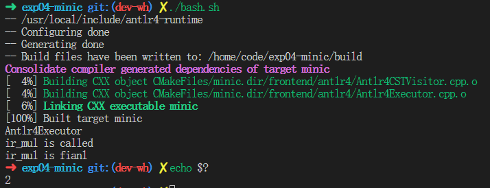
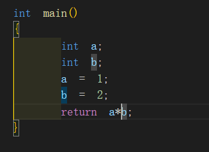
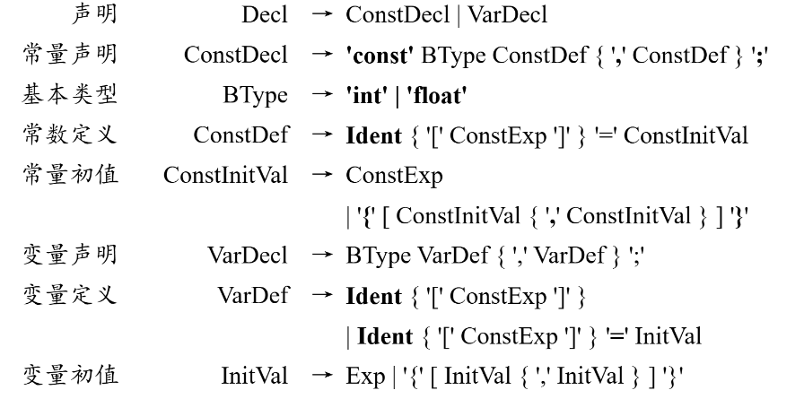

# 一、理解整个ir流程

## 目前完成了ir的乘法，已通过IRCompiler完成了验证，如下图：



## 以下讲解ir的主要内容以及修改的主要部分

### ir的主要内容：
**主体部分在/home/code/exp04-minic/ir/Generator/IRGenerator.cpp，IRGenerator是将抽象语法树(AST)转换为中间表示(IR)的核心组件，以下是其运行流程的详细说明：**

**1. 关键数据结构**

- **ast_node**：AST节点，包含子节点列表、节点类型、值信息等
- **InterCode**：存储线性IR指令序列
- **Module**：管理全局信息(函数、变量、作用域等)
- **Function**：表示函数实体，包含IR指令列表和函数信息
- **各种Instruction**：表示具体的IR指令(如BinaryInstruction、MoveInstruction等)
- **blockInsts**：ast_node 结构中的一个关键成员，用于在 AST 到 IR 的转换过程中 临时存储 当前节点及其子节点生成的所有 IR 指令。

**2. 初始化阶段**

- **构造函数**：接收AST根节点和Module对象，初始化ast2ir_handlers映射表，建立AST节点类型到处理函数的对应关系
- **处理器映射**：为每种AST节点类型(如AST_OP_ADD、AST_OP_FUNC_DEF等)注册对应的处理函数(如ir_add、ir_function_define等)

**3. 主运行流程**

1. **启动入口**：通过run()方法开始IR生成过程
2. **根节点处理**：从AST根节点(通常是编译单元AST_OP_COMPILE_UNIT)开始遍历
3. **节点分发**：通过ir_visit_ast_node方法根据节点类型调用对应的处理函数

**4. 关键节点处理流程**

 **4.1 编译单元处理(ir_compile_unit)**
- 设置当前函数为空
- 遍历编译单元中的所有子节点(函数定义或语句)
- 对每个子节点调用ir_visit_ast_node进行处理

 **4.2 函数定义处理(ir_function_define)**
1. **函数创建**：从AST节点中提取返回类型、函数名、形参和函数体
2. **作用域管理**：进入函数作用域(enterScope)
3. **IR指令生成**：
   - 生成Entry入口指令
   - 创建出口标签指令(暂不加入IR列表)
   - 处理形参列表(ir_function_formal_params)
   - 为返回值创建局部变量(非void类型)
4. **函数体处理**：处理block节点(ir_block)
5. **收尾工作**：
   - 添加出口标签指令
   - 生成Exit出口指令
   - 离开函数作用域(leaveScope)

**4.3 函数调用处理(ir_function_call)**
1. **函数查找**：根据函数名在Module中查找目标函数
2. **参数处理**：遍历实参AST节点，生成各参数的IR
3. **调用指令生成**：创建FuncCallInstruction并加入IR列表
4. **返回值处理**：将函数调用结果保存到node->val供上层使用

**4.4 基本运算处理(ir_add/ir_sub/ir_mul)**
1. **操作数处理**：递归处理左右操作数节点
2. **指令生成**：创建对应的BinaryInstruction(ADD_I/SUB_I/MUL_I)
3. **结果保存**：将运算结果保存到node->val

**4.5 变量处理流程**
- **变量声明**(ir_variable_declare)：在符号表中创建新的变量
- **变量引用**(ir_leaf_node_var_id)：从符号表中查找变量值
- **赋值处理**(ir_assign)：生成MoveInstruction实现赋值

**5. IR指令管理**

- **指令收集**：各处理函数将生成的指令添加到node->blockInsts
- **指令传递**：子节点的指令会通过blockInsts向上层节点传递
- **最终整合**：在函数定义处理中，所有指令被整合到函数的InterCode中
  
**主要修改在（可能不全）：**

/home/code/exp04-minic/bash.sh

/home/code/exp04-minic/tests/test1-1.c

/home/code/exp04-minic/ir/Instruction.h：

```
 
 /// @brief 整数的乘法指令，二元运算
    IRINST_OP_MUL_I,

```
/home/code/exp04-minic/ir/Instructions/BinaryInstruction.cpp:

```
// 在指令执行逻辑中添加（例如在某个执行循环中）
        case IRInstOperator::IRINST_OP_MUL_I: {
            // 乘法指令，二元运算
            str = getIRName() + " = mul " + src1->getIRName() + "," + src2->getIRName();
            break;
        }

```
/home/code/exp04-minic/ir/Generator/IRGenerator.cpp：
```
/* 表达式运算， 加减 */
    ast2ir_handlers[ast_operator_type::AST_OP_SUB] = &IRGenerator::ir_sub;
    ast2ir_handlers[ast_operator_type::AST_OP_ADD] = &IRGenerator::ir_add;
    ast2ir_handlers[ast_operator_type::AST_OP_MUL] = &IRGenerator::ir_mul;
```
```

/// @brief 整数乘法AST节点翻译成线性中间IR
/// @param node AST节点
/// @return 翻译是否成功，true：成功，false：失败
bool IRGenerator::ir_mul(ast_node * node)
{
    printf("ir_mul is called\n");
    // 确保有两个操作数
    if (node->sons.size() != 2) {
        minic_log(LOG_ERROR, "乘法运算需要两个操作数");
        return false;
    }

    ast_node * left = ir_visit_ast_node(node->sons[0]);
    ast_node * right = ir_visit_ast_node(node->sons[1]);

    if (!left || !right) {
        minic_log(LOG_ERROR, "乘法操作数解析失败");
        return false;
    }

    // 类型检查 - 确保都是整数类型
    if (!left->val->getType()->isIntegerType() || !right->val->getType()->isIntegerType()) {
        minic_log(LOG_ERROR, "乘法运算只支持整数类型");
        return false;
    }

    BinaryInstruction * mulInst = new BinaryInstruction(module->getCurrentFunction(),
                                                        IRInstOperator::IRINST_OP_MUL_I,
                                                        left->val,
                                                        right->val,
                                                        IntegerType::getTypeInt());

    node->blockInsts.addInst(left->blockInsts);
    node->blockInsts.addInst(right->blockInsts);
    node->blockInsts.addInst(mulInst);

    node->val = mulInst;
    printf("ir_mul is fianl\n");
    return true;
}
```
以及todo处的打印详细语句，例如：
```
// TODO 自行追加语义错误处理
        std::cout << "block解析失败 in IRGenerator" << std::endl;
```

# 二、完善ir功能

## 调试
1. 使用调试工具定位问题
使用 gdb 调试
运行以下命令启动调试器：
``` 
gdb ./build/minic
```
在 gdb 中运行程序：
```
run -S -A -I -o tests/test1-1.ir tests/test1-1.c
```
当程序崩溃时，gdb 会显示段错误发生的位置。使用以下命令查看调用栈：
```
bt
```
## declare
文法表示：
