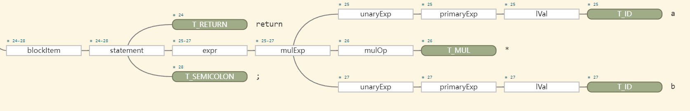
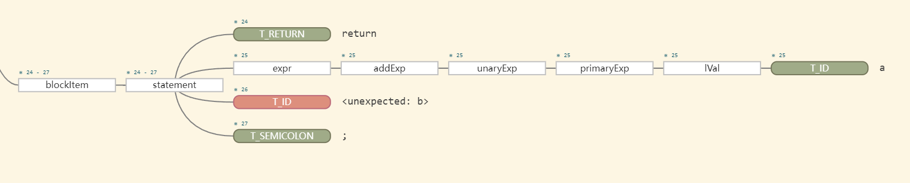
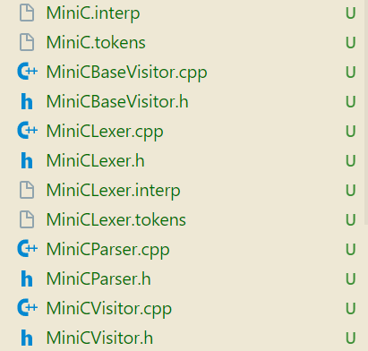
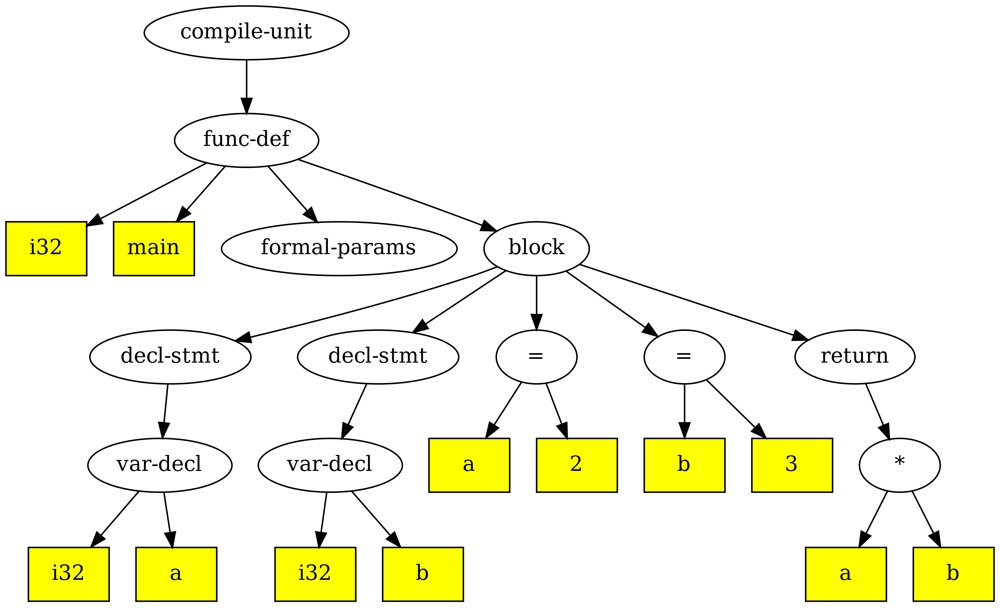

# dev_CPY开发文档
## 前端
从源程序到语法树的转换过程，其中词法/语法分析器均需要与symbol table交互

### 1. 环境配置
-    打开.zshrc

     ```shell
     vim ~/.zshrc
     ```

- 在文件末尾添加三行语句

  ```shell
  export CLASSPATH=".:$HOME/Compiler/exp04-minic-expr/thirdparty/antlr4/antlr-4.12.0-complete.jar:$CLASSPATH"
  alias antlr4='java -jar $HOME/Compiler/exp04-minic-expr/thirdparty/antlr4/antlr-4.12.0-complete.jar'
  alias grun='java org.antlr.v4.gui.TestRig'
  ```

-    sourse一下

     ```shell
     source ~/.zshrc
     ```

-    测试一下，输入antlr4

     ```shell
     antlr4
     ```

###  2. debug setting
调整vscode/lauch.json，对tests/test1-1.c，使用Debug minic Antlr4 Grammar可以生成语法分析树


###  3.antlr4：
- 语法分析器的语法文件：`*.g4`，包含了词法分析器和语法分析器的规则，需要自己添加规则
- 对`.g4`文件进行编译，生成词法分析器和语法分析器的代码
- 运行词法分析器，读取输入文件，生成token流
- 运行语法分析器，读取token流，生成语法树
- 运行语法树遍历器，遍历语法树，执行相应的操作


#### 3.1 g4文件
词法和语法部分可分开放置,也可放置在一个文件中。若分开放置,一般情况下,一个文件名为 xxxLexer.g4,另一个文件名为 xxxParser.g4。若合并放置,一般情况下文件名为 `xxx.g4`。

其中，**语法是由一系列的 EBNF 范式或产生式组成,词法由一系列的正规式或正则表达式组成**

>
> EBNF特点
> 1. EBNF 范式支持的元符号比 BNF 范式多了可选运算符?、闭包运算符*、正闭包运算符+等
> 2. 对于非终结符的产生式,若只有一个,则非常简单,只要把::或者→修改为冒号（即用冒号表示“定义为”）,  非终结符用小写字母开头,终结符号用大写字母开头,最后面追加分号
>

对于**对应多个产生式的非终结符**，如

```antlr4
// 目前语句支持return和赋值语句
statement:
	T_RETURN expr T_SEMICOLON			# returnStatement
	| lVal T_ASSIGN expr T_SEMICOLON	# assignStatement
	| block								# blockStatement
	| expr? T_SEMICOLON					# expressionStatement;
```

可以针对 statement的每个产生式起一个别名,用于后续遍历时方便定位到底 stmt 用哪个产生式来推导。该别名类似一个非终结符号名,需以小写字母开头,并且不能和其它的非终结符重名

词法部分由一系列的正规式定义组成。每条正规式定义冒号前为大写字母开头的  非终结符,冒号后给出它的正规式定义,需要时还可通过符号”->”引入一些动作符号 (比如skip), 最后以分号结尾，例如

```antlr4
T_DIGIT: [0-9][0-9]*;  
LineComment: '//' ~ [\r\n]* -> skip;
```


测试修改g4文件，添加乘法文法，尝试跑通从g4文件到AST的流程：；


```antlr4
// 表达式文法 expr : AddExp 表达式目前只支持加法与减法运算 新增了乘法运算测试 mulExp
expr: addExp | mulExp;

// 乘法表达式定义
mulExp: unaryExp (mulOp unaryExp)*;

// 乘法运算符
mulOp: T_MUL;

T_MUL: '*';
```

g4修改后可以支持乘法文法，写一个测例tests/test-mul.c

```cpp
int main()
{
    int a;
    int b;
    int c,d;
    a = 2;
    b = 3;

    return a * b;
}
```

使用debug的Debug minic Antlr4 Grammar模式测试（需要在编辑器中打开g4文件），如果文法正确可以生成一颗AST



其中包含mulExp。如果将`tests/test-mul.c`中的return语句改为

```cpp
return a / b;
```

debug后会显示错误



修改完成后，还要重新生成antlr4相关文件，采用命令如下：

```shell
antlr4 -Dlanguage=Cpp -visitor -no-listener /home/cpy/Compiler/exp04-minic-expr/frontend/antlr4/MiniC.g4
```
参数说明（依据exp04选择的参数）：

-    -Dlanguage=Cpp 表示生成的语言为C++
-    -visitor 表示生成visitor模式的C++文件
-    -no-listener 表示不生成listener模式的文件
-    /home/cpy/Compiler/exp04-minic-expr/frontend/antlr4/MiniC.g4 这是g4文件的路径

会生成以下自动文件（放入autogenerated文件夹）：



包含词法分析程序 MiniCLexer.cpp 与 MiniCLexer.h,语法分析程序  MiniCParser.cpp 与 MiniCParser.h, Visitor 模式基类程序 MiniCVisitor.cpp、  MiniCVisitor.h、MiniCBaseVisitor.cpp 与 MiniCBaseVisitor.h 等。用户可**继承实现类 MiniCBaseVisitor ，并重载实现虚函数，增加动作来实现对语法分析程序生成的具体语法树进行遍历实现特定的功能**。

#### 3.2 修改Antlr4CSTVisitor

实现一个MiniCBaseVisitor 的子类,重载需要的虚函数, 在这里子类的名称为 Antlr4CSTVisitor。

需要注意的是,**对于一个非终结符包含多个产生式并且对每个产生式起名的,需要做特殊处理**,如上面的非终结符号 statement,父类中并没有提供对 statement 的直接 visit 函数:visitStatement,但是却提供了 visitReturnStatement、visitAssignStatement、visitBlockStatement与  visitExpressionStatement 函数,因此在 Antlr4CSTVisitor 中需要定义  visitStatement 的包含函数或者私有函数,在该函数中实现对语法节点的遍历。

```cpp
// MiniCBaseVisitor Class Operations for Statement
  virtual std::any visitReturnStatement(MiniCParser::ReturnStatementContext *ctx) override {
    return visitChildren(ctx);
  }

  virtual std::any visitAssignStatement(MiniCParser::AssignStatementContext *ctx) override {
    return visitChildren(ctx);
  }

  virtual std::any visitBlockStatement(MiniCParser::BlockStatementContext *ctx) override {
    return visitChildren(ctx);
  }

  virtual std::any visitExpressionStatement(MiniCParser::ExpressionStatementContext *ctx) override {
    return visitChildren(ctx);
  }
```

那么针对乘法文法的添加，MiniCBaseVisitor 中自动生成了如下虚函数定义：

```cpp
 virtual std::any visitMulExp(MiniCParser::MulExpContext *ctx) override {
    return visitChildren(ctx);
  }

  virtual std::any visitMulOp(MiniCParser::MulOpContext *ctx) override {
    return visitChildren(ctx);
  }
```

对应地，在Antlr4CSTVisitor类中添加如下定义：

```cpp
	///
	/// @brief 非终结符MulExp的分析
	/// @param ctx  CST上下文
	/// @return std::any  AST的节点
	///
    std::any visitMulExp(MiniCParser::MulExpContext * ctx) override;

	///
	/// @brief 	非终结符MulOp的分析
	/// @param ctx 	CST上下文
	/// @return std::any  AST的节点
	///
    std::any visitMulOp(MiniCParser::MulOpContext * ctx) override;
```

需要在Antlr4CSTVisitor.cpp进行实现

```cpp
/// @brief 非终结运算符expr的遍历，加入mulExp
std::any MiniCCSTVisitor::visitExpr(MiniCParser::ExprContext * ctx)
{
    // 识别产生式：expr: addExp | mulExp;
    if (ctx->mulExp()) {
        return visitMulExp(ctx->mulExp());
    } else if (ctx->addExp()) {
        return visitAddExp(ctx->addExp());
    }
}

std::any MiniCCSTVisitor::visitMulOp(MiniCParser::MulOpContext * ctx)
{
    // 识别的文法产生式：mulOp : T_MUL
    if (ctx->T_MUL()) {
        return ast_operator_type::AST_OP_MUL; // 对应乘法操作符
    }
    return ast_operator_type::AST_OP_MAX; // 对应非法操作符
}

std::any MiniCCSTVisitor::visitMulExp(MiniCParser::MulExpContext * ctx)
{
    // 识别的文法产生式：mulExp : unaryExp (mulOp unaryExp)*;

    if (ctx->mulOp().empty()) {
        // 没有mulOp运算符，则说明闭包识别为0，只识别了第一个非终结符unaryExp
        return visitUnaryExp(ctx->unaryExp()[0]);
    }

    ast_node *left, *right;

    // 存在mulOp运算符
    auto opsCtxVec = ctx->mulOp();

    // 有操作符，肯定会进循环，使得right设置正确的值
    for (int k = 0; k < (int) opsCtxVec.size(); k++) {
        // 获取运算符
        ast_operator_type op = std::any_cast<ast_operator_type>(visitMulOp(opsCtxVec[k]));

        if (k == 0) {
            // 左操作数
            left = std::any_cast<ast_node *>(visitUnaryExp(ctx->unaryExp()[k]));
        }

        // 右操作数
        right = std::any_cast<ast_node *>(visitUnaryExp(ctx->unaryExp()[k + 1]));

        // 新建结点作为下一个运算符的右操作符
        left = ast_node::New(op, left, right, nullptr);
    }

    return left;
}
```

#### 3.3 Antlr4Executor 主程序

这是词法与语法分析的执行主程序实现。

其中 filename 为词法分析的对象文件路径,其中 MiniCLexer 为词法分析器、MiniCParser 为语法分析  器,这两个类都是 antlr4 根据 g4 文件自动生成的,而 MiniCCSTVisitor 为用户实现的分析树或具体语法树的遍历从而实现特定的功能,这里实现的是生成抽象语法树 AST。

#### 3.4 AST图形输出显示

通过 graphviz 提供的 API 实现抽象语法树图形的显示。具体实现在 graph.cpp 与 graph.h,递归遍历抽象语法树,利用  graphviz 提供的 C 语言 API 进行产生图形的结点以及边等信息,直接输出到指定的文件中

```cpp
/// @brief 抽象语法树AST的图形化显示，这里用C语言实现
/// @param root 抽象语法树的根
/// @param filePath 转换成图形的文件名，主要要通过文件名后缀来区分图片的类型，如png，svg，pdf等皆可
///
void OutputAST(ast_node * root, std::string filePath);
```

在`main.cpp`中，可以设定

```cpp
///
/// @brief 显示抽象语法树，非线性IR
///
bool gShowAST = true;
```

`./build/minic`执行的可选参数如下

```cpp
// 指定参数解析的选项，可识别-h、-o、-S、-T、-I、-A、-D等选项
// -S必须项，输出中间IR、抽象语法树或汇编
// -T指定时输出AST，-I输出中间IR，不指定则默认输出汇编
// -A指定按照antlr4进行词法与语法分析，-D指定按照递归下降分析法执行，不指定时按flex+bison执行
// -o要求必须带有附加参数，指定输出的文件
// -O要求必须带有附加整数，指明优化的级别
// -t要求必须带有目标CPU，指明目标CPU的汇编
// -c选项在输出汇编时有效，附带输出IR指令内容
```

那么可以使用以下命令来输出AST图形到./tests/test-mul-AST.png路径

```shell
# cmake根据CMakeLists.txt进行配置与检查，这里使用clang编译器并且是Debug模式
cmake -B build -S . -DCMAKE_BUILD_TYPE=Debug -DCMAKE_CXX_COMPILER:FILEPATH=/usr/bin/clang++
# cmake，其中--parallel说明是并行编译，也可用-j选项
cmake --build build --parallel

./build/minic -S -T -A -o ./tests/test-mul-AST.png ./tests/test-mul.c
```



#### 3.5 其他修改

在`AST.h`中添加符号`*`

```cpp
///
/// @brief AST节点的类型。C++专门运用枚举类来区分C语言的结构体
///
enum class ast_operator_type : int {
    /* 以下为AST的叶子节点 */
    	...
    /* 以下为AST的内部节点，含根节点 */
        ...
    // TODO 抽象语法树其它内部节点运算符追加

    /// @brief 二元运算符*
    AST_OP_MUL,

    /// @brief 最大标识符，表示非法运算符
    AST_OP_MAX,
};
```

在`Graph.cpp`中，加入作图时节点的名字，否则输出图在乘号节点会显示unknown

```cpp
string getNodeName(ast_node * astnode)
{
    string nodeName;
    switch (astnode->node_type) {
            // TODO 这里追加其它类型的结点，返回对应结点的字符串
        case ast_operator_type::AST_OP_MUL:
            nodeName = "*";
            break;
        default:
            nodeName = "unknown";
            break;
    }
    ...
}
```

#### 3.6 Debug AST

或者采用Debug AST模式，在launch.json中修改对应的参数(注意在修改代码以后先点 `“（齿轮）生成”` 修改才能生效)

```json
{
	"args": ["-S", "-A", "-T", "-o", "tests/test-mul-AST.png", "tests/test-mul.c"],
}
```

在主函数中即可从compile进入编译

```cpp
result = compile(gInputFile, gOutputFile);
```

再从frontEndExecutor->run()进入

```cpp
 // 前端执行：词法分析、语法分析后产生抽象语法树，其root为全局变量ast_root
 subResult = frontEndExecutor->run();
```

即可逐步调试观察AST的遍历，或在出现错误时通过调用堆栈找出错误来源

